# Gameland

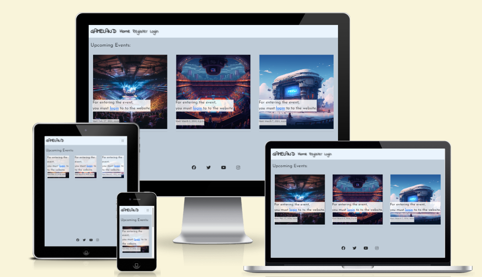

# An Events Registration Website.
> An events registration website showcasing upcoming events. This site empowers users to register on the website and participate in upcoming events.

## **[Live site](https://gameland-b306d6404761.herokuapp.com/)**

---

## **[Repository](https://github.com/Karoskodev/Gameland)**

---

## Table of contents
<a name="contents">Back to Top</a>
 1. [ UX ](#ux)
 2. [Agile Development](#agile)
 3. [ Features ](#features)  
 4. [ Features Left to Implement ](#left)  
 5. [ Technology used ](#tech) 
 6. [ Testing ](#testing)  
 7. [ Bugs ](#bugs)  
 8. [ Deployment](#deployment)
 9. [ Credits](#credits)
 10. [ Content](#content)  
 11. [ Acknowledgements](#acknowledgements)

 ## UX

#### Pre-project Planning

> Database Structure

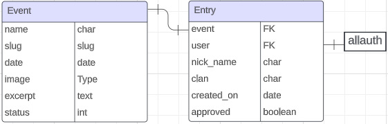

- When I decided on my initial concept of Gameland I knew I needed to understand what type of data I would need to store and the relationships between them.
- I created the above diagram on lucidchart to help guide me.

### Database Schema
#### Event Model

| id | Field |
|--|--|
| name |CharField  |
| slug |SlugField|
|date|DateTimeField|
|image|CloudinaryField|
|excerpt|TextField|
|status|IntegerField|

---

#### Entry Model

| id | Field |
|--|--|
| event |ForeignKey|
|user|ForeignKey|
|nickname|Charfield|
|clan|Charfield|
|created_on|DateTimeField|
|approved|BooleanField|

---

# UX design

## Overview

Gameland is your go-to for immersive events.  
The main goal of the website is to allow users to view Events, user can create an account and use it to entry Event.

### Design
Once the name was chosen I decided that I wanted this website to be modern, minimalistic in it's appearance to use colors of blue and White where possible.

### Site User

 - Someone looking to attend Esport events
 - Someone who would prefer to make bookings digitally rather than speaking with others

###  Goals for the website

- Easily check out Events beforehand.
- Quickly book your spot in Events and store entries in a neat place for staff to accept / decline in an easy manner depending on occupancy.

## Wireframes

###  Wireframes

My goal for this project was to create a simple sleek website that allowed the admin create, change, filter or delete an Events and the users register to the website and create, edit,delete entry for Events

> index.html

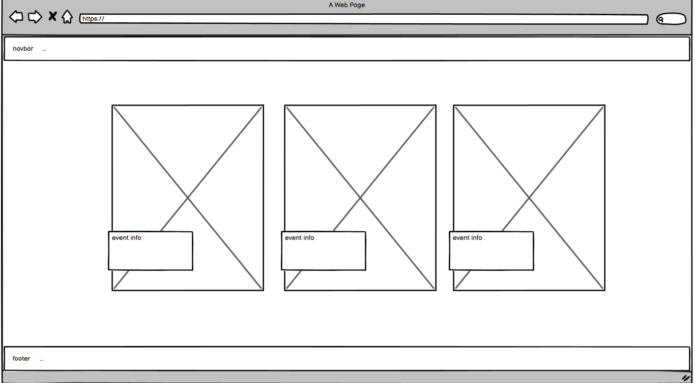

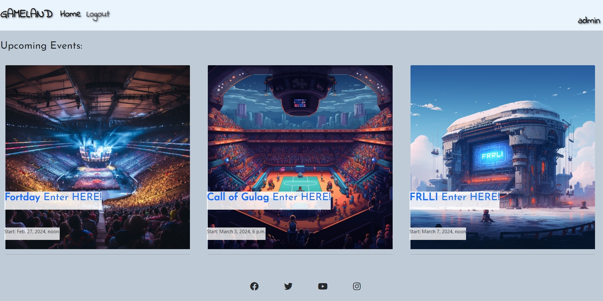

> event_detail.html

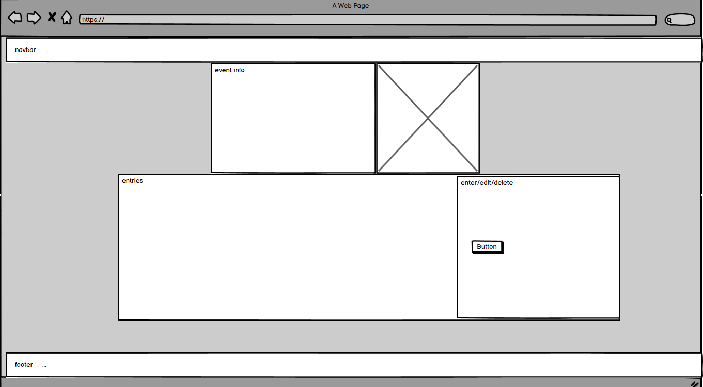

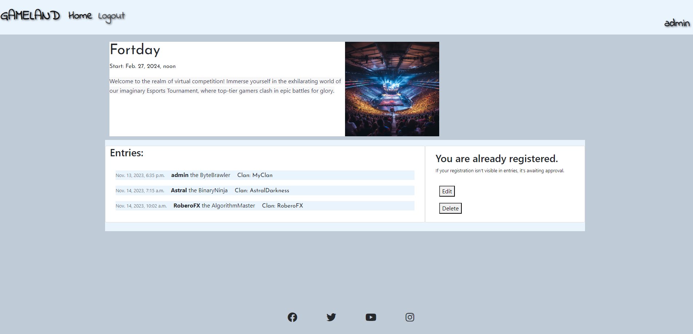

## Agile Development

### Agile Overview

This project was started alongside a GitHub Projects Page to track and manage the expected workload ahead.
The aim was to set out my expected workload, list the user stories and ultimately finish the site in good time.

To see Kanban please click [here](https://github.com/users/Karoskodev/projects/9).

At the initial stages I decided on 2 epics and 10 user stories. When I started working on user stories and epics I moved them from todo to in progress, when I finished them I moved them from in progress to done

#### User stories

#####  Completed User Stories

To view any of the expanded details of the user stories please click on a user story below to be taken to the Kanban project.
If the specific user story does not auto pop up then please click on it from the project page and you will see the details and comments.

 1. [USER STORY: Early Deployment #1](https://github.com/Karoskodev/Gameland/issues/1)
 2. [USER STORY: Account registration #2](https://github.com/Karoskodev/Gameland/issues/2)
 3. [USER STORY: View Events List #3](https://github.com/Karoskodev/Gameland/issues/3)
 4. [USER STORY: Open an Event #4](https://github.com/Karoskodev/Gameland/issues/4)
 5. [USER STORY: Join an Event #5](https://github.com/Karoskodev/Gameland/issues/5)
 6. [USER STORY: Change Event Registration #6](https://github.com/Karoskodev/Gameland/issues/6)
 7. [USER STORY: Remove Event registration #7](https://github.com/Karoskodev/Gameland/issues/7)
 8. [USER STORY: List of Players #8](https://github.com/Karoskodev/Gameland/issues/8)
 9. [USER STORY: Manage Events #9](https://github.com/Karoskodev/Gameland/issues/9)
 10. [USER STORY: Approve Registrations #10](https://github.com/Karoskodev/Gameland/issues/10)

## Features

#### User based Features Implemented:

 - **Users can** create an account (**Create**)
 - **Users can** log into their account
 - **Users can** log out of their account
 - **Users can** view list of Events (**Read**)
 - **Users can** make a registration for an event **(Create)**
 - **Users can** add their nick name and clan for each entry (**Create**)
 - **Users can** view entries for specific event (**Read**)
 - **Users can** edit their nickname and clan for existing entry (**Update**)
 - **Users can** delete entry at any stage of the process (**Delete**)

#### Account restrictions:
 - **Users cannot** access event details without being logged in
 - **Users cannot** edit entry without being logged in
 - **Users cannot** create multiple entries for one event
 - **Users cannot** access the admin panel of the website unless they have admin status

#### Website features:

##### Dynamic Events listings

 - The website displays events that are updated on the back end and shown on the front-end.
 - If the event is updated by the business owner then this change will reflect on the front end.
 - This allows the business owner to make easy changes.

##### Events registration System

 - Once a user has created an account they can view events details and create registration requests for event.
 - Once a user is registered in an event he can edit or delete his entry.

##### Website registration System

 - The user can register on the website
 - The user can log in to the website
 - The user can log out of the website

### index.html

> Navbar

 - navbar consists of Logo, Home, Register, Login links.
 - If the user is logged in they have access to logout and the username is displayed on the right side of navbar.

 
---

> Events

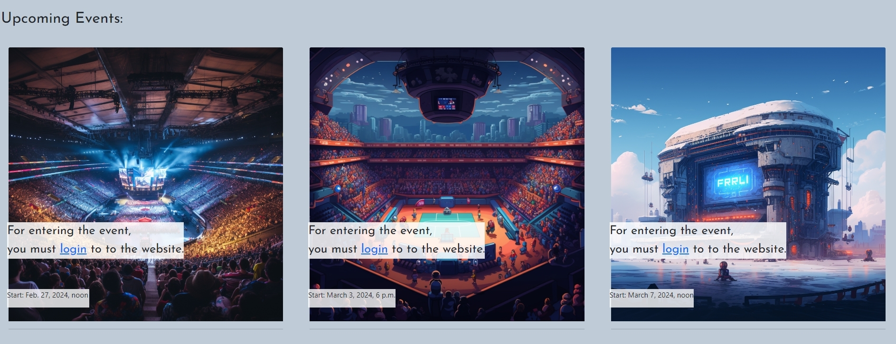

- list of events with start dates and with message asking users to log in if they want to enter event
- If the user is logged in they can enter event.

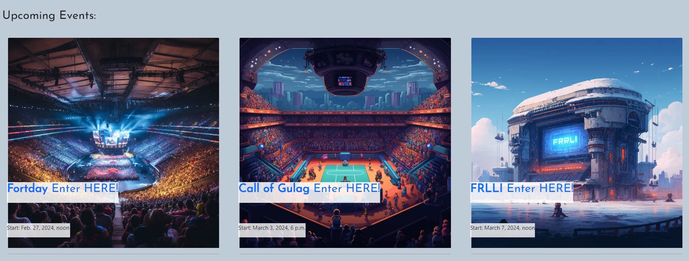

---

> Footer

- footer with social links.

---

### event_detail.html

> Event info

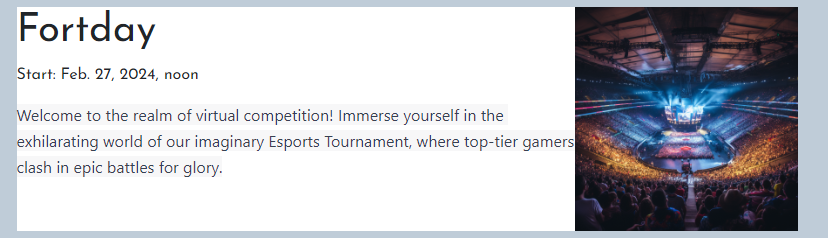

 - event info with event image

---

> Entries

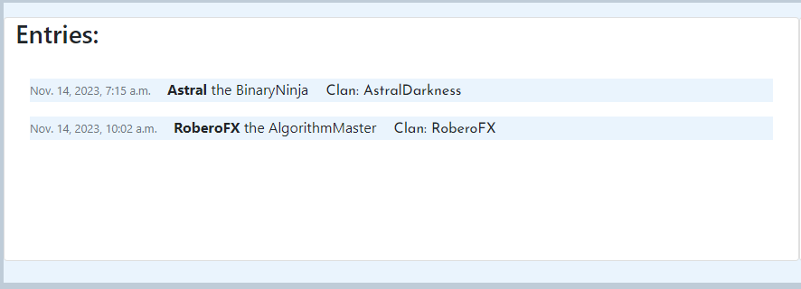

 - list of entries for opened event with dates, users, nicknames, clans

---

> Event register form

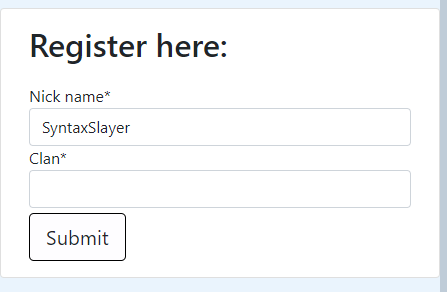

 - event register form with nickname and clan fields

---

> Approval message

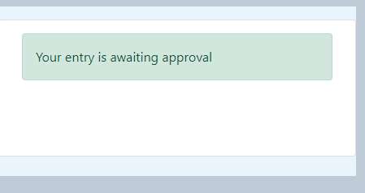

 - awaiting approval message after event registration submition

---

> Edit entry

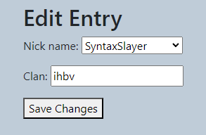

 - user can edit nickname and clan

---

> Delete entry

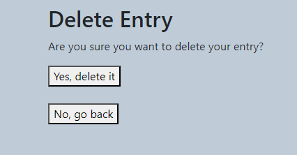

 - user can delete entry

---

> Messages

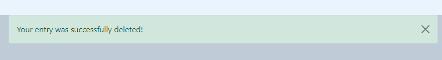
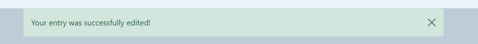

 - messages after entry edit or deletion

---

## Features left to Implement 

 - Add ability for users to open pofile page and add profile picture
 - Add ability for users to open a list of all their entries
 - Add ability for users to create Events
 - Add ability for users to reset or change the password
 - Allow users to sign up with social media
 - Add gallery with photos from events

 ---

 
##  Technology Used

### Html

 - Used to structure my webpages and the base templating language

### CSS

 - Custom CSS to make it as close to the wireframes as I felt it needed to be.

### JavaScript

 -  Used to add timeout function for messages as well as to enable the menu on index.html

### Python

 -  Used for the logic in this project.

### Django

 -  Framework used to build this project. Provides a ready installed admin panel and includes many helper template tags that make writing code quick and efficient.

### Font Awesome

 -  Icon library used for the profile and admin panel section.

### Bootstrap 5
 - Used as the base front end framework to work alongside Django

### GitHub
 - Used to store the code for this project & for the projects Kanban board used to complete it.

### Heroku
- Used to host and deploy this project

### Heroku PostgreSQL
-Heroku PostgreSQL was used as the database for this project during development and in production.

### Cloudinary
- Used to host the static files for this project including user profile images.

---

## Testing

### Testing Phase

#### Manual Testing

> Each user story was manually tested in line with intended functionality on both desktop & mobile.
> As this project was driven by my own User Stories I felt manual testing was applicable on all logic code.

>If the intended outcome completes then this will be flagged as pass. If it does not then this is a fail.

#### Account Registration Tests
| Test |Result  |
|--|--|
| User can create account | Pass |
| User can log into account| Pass|
|User can log out of account|Pass|

---

#### User Navigation Tests

| Test |Result  |
|--|--|
|User can navigate to Events | Pass |
|User can access Events details| Pass|
|SuperUser can access admin panel|Pass|

---

#### Account Security Tests

| Test |Result  |
|--|--|
|Non logged in user cannot access Events details | Pass |
|Non logged in user cannot register in to Event| Pass|
|Non superuser cannot access admin panel|Pass|

---

#### Admin Tests

| Test |Result  |
|--|--|
|Admin can add Events |Pass|
|Admin can edit events|Pass|
|Admin can delete events|Pass|
|Events they display correctly on front-end when updated / added|Pass|
|Admin can approve Events entries |Pass|

#### Events Entries Tests

| Test |Result  |
|--|--|
|User can register in to event |Pass|
|User can edit events registrations|Pass|
|User can delete events registrations|Pass|

---

## Google Lighthouse Testing

> index.html

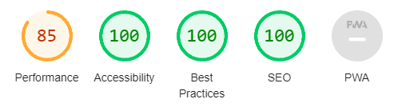

> event_detail.html

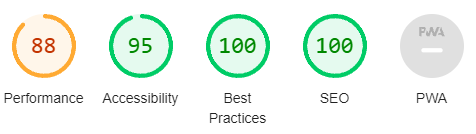

## HTML W3 Validation

### index.html

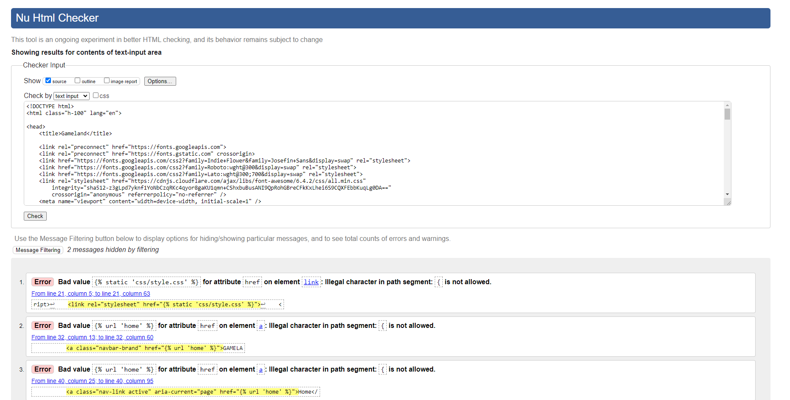
### Result: Multiple Errors Related to Django Templates, These errors can be safely ignored, as they are specifically tied to the Django templating system.

### CSS Validation

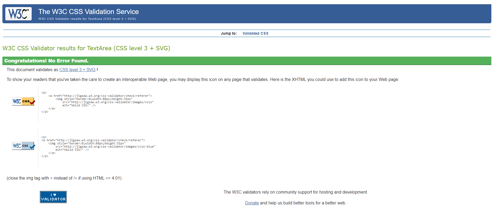
#### Result: Pass - No Errors

---

## **Bugs**

#### W3 Validation
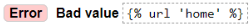

- When I ran my code through the w3 html validator I got Multiple Errors Related to Django Templates, These errors can be safely ignored, as they are specifically tied to the Django templating system.